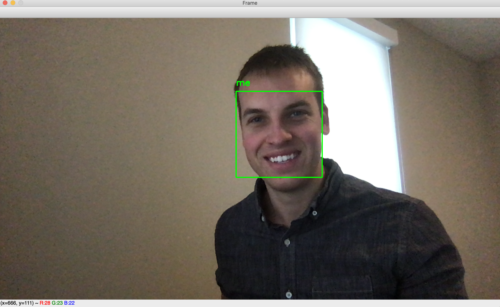

# Coyote-Vision

Coyote-Vision is designed to allow any user to train an image classfication model locally on their machine to detect your own face. Once the model is trained, it will use the built in camera on your machine (mac only) to make sure you are at your keyboard while the machine is unlocked. If the model doesn't detect your face for about 8 seconds, your machine will become locked automatically.

### Prerequisites

Python 3.7
Currently only works on mac with the built in webcam

### Installing

```
git clone https://github.com/koskorya/Coyote-Vision.git
cd Coyote-Vision/
pip3 install -r requirements.txt
```

## Running Coyote-Vision

There are 3 optional flags you can run:
    1. `-d` will display what your webcam sees and the face the software recognizes. It will display 'Me' for the trained dataset and 'Unknown' for any face not recognized.

    2. `-a` will allow you to add more images to your existing dataset and retrain the model.

    3. `-r` will completely retrain the dataset from scratch.
```
cd Coyote-Vision/
python3 main.py -d
```

You will be asked whether to allow the program access to your camera so make sure to click 'Allow'.

## Training your model

Upon first execution you will see an opencv rocket python icon where it will be detecting faces in the webcam. 

Make sure that only your face is detected in the image and press the `k` key on your keyboard to store the image to disk. It is also important to try and get a wide range of angles of your face, different lighting, and different facial expressions you may express throughout the day. I recommend at least 20 images minimum. 

Once you are done capturing your face press `q` to start the encoding process. Once all of the images are encoded (roughly 7 seconds per image) the program will start detecting faces and will display if it recognizes a face with a green bounding box and label.

If it does not detect your face for about 8 seconds, the machine will automatically lock.

Enjoy!


## Acknowledgments

* Helpful tutorials courtesy of https://www.pyimagesearch.com/
* Core python package courtesy of https://github.com/ageitgey/face_recognition Awesome blog here: https://medium.com/@ageitgey/machine-learning-is-fun-part-4-modern-face-recognition-with-deep-learning-c3cffc121d78
